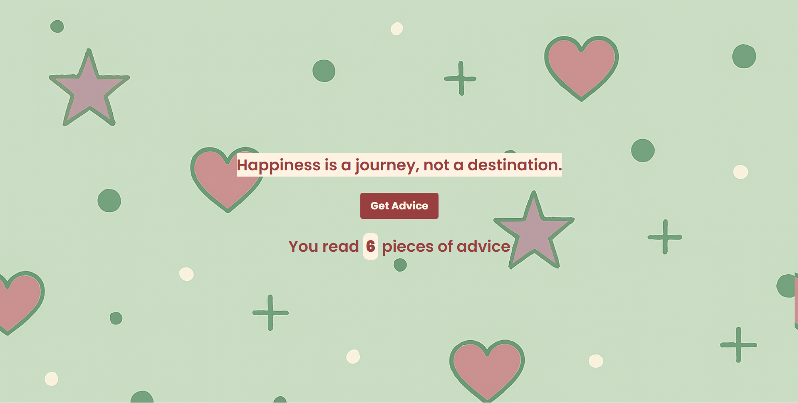

# React Advice App

A simple Advice generator app built with **React**.  
It allows users to get an advice by clicking a button.

## Live Demo
Check out the live version of this project [here](https://react-advice-app-nine.vercel.app/).

## 🚀 Features
- Generates an advice by clicking a button
- Gives you the count of advices you read
- With a cheerful background image
- Built with **React Hooks**

  ## 📸 Preview


## 🛠️ Technologies Used
- **React.js**
- **JavaScript**
- **HTML5**
- **CSS3**
- **Vite**
- **Adviceslip API**
- **Postman**
- **Prettier**

## 📦 Installation
```bash
git clone https://github.com/osvi-25/react-advice-app.git
cd react-advice-app
npm install
npm start
```

## 🧑‍💻 Usage
 
1. **Click Get Advice** to get an advice and the count of advices you read.  
