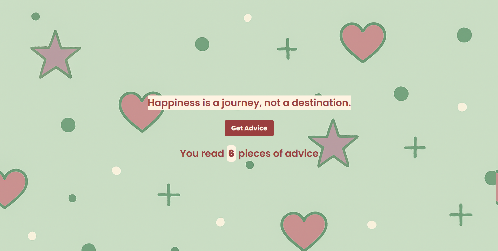

# React Advice App

A simple Advice generator app built with **React**.  
It allows users to get an advice by clicking a button.

## 🚀 Features
- Generates an advice by clicking a button
- Gives you the count of advices you read
- With a cheerful background image
- Built with **React Hooks**

  ## 📸 Preview


## 🛠️ Technologies Used
- React
- Adviceslip API (https://api.adviceslip.com/advice)

## 📦 Installation
```bash
git clone https://github.com/osvi-25/react-advice-app.git
cd react-advice-app
npm install
npm start
```

## 🧑‍💻 Usage
 
1. **Click Get Advice** to get an advice and the count of advices you read.  
